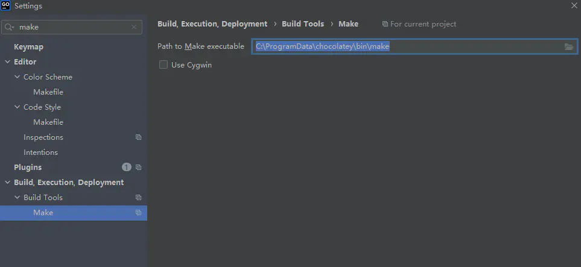

## GoSnake 开发指南

数据库选择 gorm 因为github上面提交次数更频繁

框架使用gin

应用的构建遵循 [Preview \README_zh-CN.md - golang-standards/project-layout - GitHub1s](https://github1s.com/golang-standards/project-layout)

目录结构

- **config**配置项
- **pkg**：存放的是可供项目内部/外部所使用的公共性代码
- **docs**：项目说明文档
- **internal**：internal 包主要用处在于提供一个项目级别的代码保护方式，存放在其中的代码仅供项目内部使用
- **Makefile**：Makefile 文件通常存放项目的编译部署脚本。Go 的编译命令虽然简单，但总是手写命令还是效率低下，因此使用 Makefile 写编译部署脚本是工程实践中常见的方式。
- **scripts**：构建，安装，分析等的脚本
- **deployments**：关于iaas paas，以及部署的
- `/init` 系统初始化（systemd、upstart、sysv）和进程管理（runit、supervisord）配置。

### JWT

包：github.com/dgrijalva/jwt-go

参考文档：[golang jwt-go的使用 - 是阿江啊 - 博客园 (cnblogs.com)](https://www.cnblogs.com/jianga/p/12487267.html)

### UUID

github.com/satori/go.uuid 据说比谷歌的UUID好 博主未进行研究

### singleflight

在java中 有 OncePerRequestFilter
对一个资源请求去重复 [singleflight防止缓存击穿](https://links.jianshu.com/go?to=https%3A%2F%2Fwww.cnblogs.com%2Fchaunceeeeey%2Fp%2F12740922.html)

### gin-swagger生成API文档

github地址：https://github.com/swaggo/gin-swagger

### 快速的http请求

github.com/valyala/fasthttp

### Golang 热编译rizla 插件

XXXX

```shell
# 安装rizla包
$ go get -u github.com/kataras/rizla
# 重启终端
# 热重启方式启动iris项目
$ rizla main.go
```

使用 fresh 实现热部署

```shell
# 安装 fresh
$ go get github.com/pilu/fresh

# 跳转到项目目录,例如项目名为‘myapp’
$ cd /path/to/myapp

# 启动
$ fresh
```

### goconvey 代码覆盖率

windows上安装：chocolatey 然后执行：

```shell
choco install make
```

然后golang 的setting菜单搜索make 配置make的路径：

https://github.com/smartystreets/goconvey

make的安装路径是：C:\ProgramData\chocolatey\bin\make

